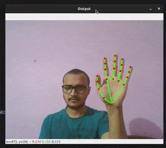

# Hand Gesture-Controlled Web Browser

This project allows users to open specific web pages using hand gestures detected via webcam. By showing a certain number of fingers in front of the camera, the system automatically opens a web browser corresponding to the detected finger count. The application uses **OpenCV** and **MediaPipe** to detect hand gestures in real-time and performs actions based on the number of raised fingers.


<p align="center">
  
</p>


## Features

- **Real-Time Gesture Detection**: Detects hand gestures using a webcam.
- **Finger Count Recognition**: Counts the number of fingers held up and maps it to a specific web page.
- **Automated Browser Opening**: Opens a web browser with the desired website after a 5-second countdown.
- **Simple, Intuitive Interface**: Users can control the application through natural hand movements.

## How It Works

1. The webcam captures the user's hand.
2. Using MediaPipe's hand landmark detection, the program identifies key points of the hand.
3. Based on the number of raised fingers, the program opens a web page:
   - **1 Finger**: [YouTube](https://www.youtube.com)
   - **2 Fingers**: [Twitter](https://www.twitter.com)
   - **3 Fingers**: [Amazon](https://www.amazon.in)
   - **4 Fingers**: [Facebook](https://www.facebook.com)
   - **5 Fingers**: [Wikipedia](https://www.wikipedia.com)

## Technologies Used

- **Python**: The primary programming language used for the project.
- **OpenCV**: To handle image capture from the webcam and display video frames.
- **MediaPipe**: For real-time hand tracking and gesture detection.
- **WebBrowser Module**: To open web pages based on detected gestures.

## Future Scope

- **Customizable Websites**:  
  A user interface where users can dynamically set and save URLs for different finger gestures.

- **Multi-Page Support**:  
  Detecting more complex gestures like two hands for advanced functionality (e.g., next/previous tabs).

- **Mobile Integration**:  
  Extending the system for mobile devices or building an Android/iOS app using frameworks like Kivy or Flutter.

- **Gesture-Based Navigation**:  
  Adding gestures like swipes or hand motions to control browser navigation (scrolling, closing tabs, etc.).

- **Enhanced Accuracy**:  
  Using AI models for improved accuracy in gesture detection in varied lighting conditions or from different angles.

## Setup Instructions

1. Clone this repository:

   ```bash
   git clone https://github.com/vikasverma67/hand-gesture-browser.git
   cd hand-gesture-browser
   
2. Install dependencies:

    ```bash
    pip install opencv-python mediapipe
    
3. Run the Python Script:

    ```bash
    python hand_gesture_browser.py
    
4. Ensure your webcam is working, and perform hand gestures in front of the camera to open the mapped websites.

## Contribution

Feel free to fork the project and submit pull requests. Your contributions are always welcome!
